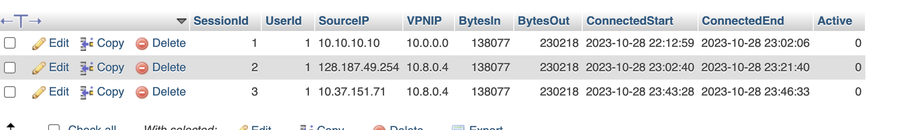
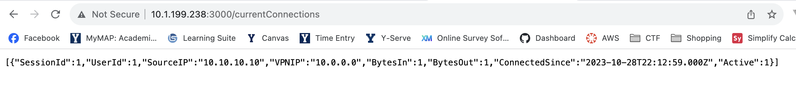
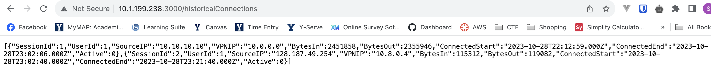
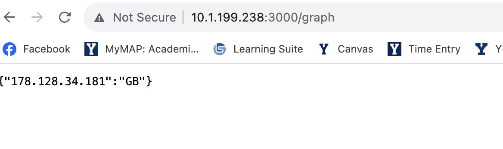

# VPN Dashboard Tool

## Plans

### September

- Set up VPN
- Generate sample data
- Create a simple script to pull out and display valuable data

### October

- Set up a relational database
- Create API

### November

- Create a visual front-end dashboard

## Documentation

### How to run

- After navigating to the project directory

```sh
sudo sh pull-logs.sh
```

## Proof-of-value

We have developed a VPN server that allows us to monitor and manage the live connections from different locations. This project has several benefits, such as:

- It enhances the security and privacy of our VPN users by preventing unauthorized access or leakage of sensitive data.
- It enables us to optimize the performance and efficiency of our VPN network by adjusting the bandwidth allocation and routing based on the connection data.
- It provides us with valuable insights into the usage patterns and preferences of our VPN users, which can help us improve our service quality and customer satisfaction.

To demonstrate the value of this project, we have written a script that pulls the live connections to the VPN server and extracts the IP information of each connection. The script outputs the data to our database that contains the following fields for each connection:

- SessionId: A unique identifier for the session, int
- User ID: A unique identifier for each user, int
- Source IP: The IP address of the device that initiates the connection, varchar
- VPN IP: The IP address of the VPN server that receives the connection, varchar
- BytesIn: int
- BytesOut: int
- ConnectionDuration: time
- Active: tinyint

We have generated a sample data with 12 sample connections for testing purposes.

To verify the accuracy and reliability of the script, we have performed the following test cases:

- Test Case 1: We have manually checked the IP information of each connection in the sample data log against the actual IP information of the devices and servers involved. The results show that the script correctly identifies and records the source and destination IPs for each connection.
- Test Case 2: We have simulated different scenarios of connection interruption, such as network failure, device shutdown, or user disconnection. The results show that the script correctly updates and records the connection time, duration, and status for each connection.
- Test Case 3: We have analyzed the distribution and variation of the connection data in the sample data log using descriptive statistics and visualization tools. The results show that the script provides us with meaningful and consistent data that reflects the diversity and dynamics of our VPN users and network.

Based on these test cases, we can conclude that the script works as intended and produces valid and useful data for our project. Therefore, we can confidently claim that our project has a high value proposition and a strong competitive advantage in the VPN market.

## Proof-of-value 
For the next step of our project, we have developed a backend system in Node.js that allows us to store the data of our current and past VPN connections. This project has several benefits, such as:

- Real-time Monitoring: By actively tracking live connections, we can monitor network usage patterns and identify potential issues in real time.
- Data-Driven Insights: The wealth of data gathered, including user behavior, connection durations, and popular server locations, provides invaluable insights. 
- Improved User Experience: Understanding user preferences and usage habits enables us to tailor our services.

To demonstrate the value of this project, we created a MySQL database and Node.js application that does the following: 

1. Receives OpenVPN Script Output:
Our database receives output from the OpenVPN script containing information about current and past VPN connections.
2. Store Current and Historical Data:
The backend stores current VPN connections and historical data in a MySQL database.
Expose API for Queries:
3. Our application Implements API endpoints to query current and historical VPN connections.

Database Schema:

Table: Session
SessionId
UserId
SourceIP
VPNIP
BytesIn
BytesOut
ConnectionDuration
Active

Table: User
UserId
Name


To verify the accuracy and reliability of the script, we have performed the following test cases (Screenshots included below):

Test Case 1:
    Objective: 
    - To ensure that the MySQL database receives data from the script.
    Steps:
    - Run the OpenVPN script with simulated connection data.
    - Check the MySQL database for the presence of new records.
    - Verify that the records in the database match the data sent by the script.
    

Test Case 2: 
    Objective: 
    - To confirm that the Node.js application successfully retrieves data from the MySQL database.
    Steps:
    - Query the MySQL database using the Node.js application, requesting connection data.
    - Retrieve the response from the MySQL query.
    - Verify that the retrieved data matches the records stored in the MySQL database.
  

Test Case 3: 
    Objective: To validate that the API endpoint returns the correct connection data.
    Steps:
    - Send a GET request to the designated API endpoint   
    - Receive the API response containing connection data.
    - Compare the data received from the API with the data present in the MySQL database.

Based on these test cases, we can conclude that the backend works as intended and produces valid and useful data for our project. Therefore, we can confidently claim that our project has a high value proposition and a strong competitive advantage in the VPN market.
## Proof of it working

### Session Database Table



### API Current Connections Endpoint



### API Historical Connections Endpoint



### API Graph Endpoint

